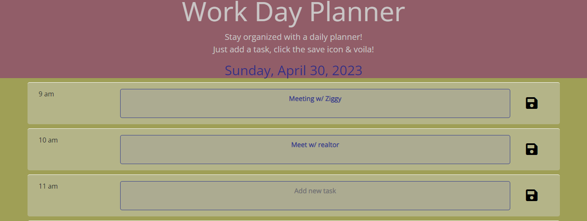

# Work Day Planner

## Description

When this web application loads, the user is presented with a header that introduces the application, gives a quick description of how to use it and displays the current date. The main content includes a schedule labeled with standard business hours (9am-5pm), a text box & a save button. The user can type a new task into the text box of the desired time block & hit save to store the task in localStorage. When the application is refreshed, the task stays displayed on the screen. The time blocks are color-coded to indicate if the current time block is in the past (gray), present (orange) or future (green).

## Usage

This application is used as a daily planner to save & display a user's tasks.

## Deployed Application
<a href="https://techmack92.github.io/work-day-planner/">***Work Day Planner.***</a>

## Technologies Used
+ HTML
+ CSS
+ JavaScript
+ jQuery
+ Bootstrap

## Mock-Up

The following snippet shows the web application's appearance and functionality:

## License

 Licensed under the <a href="https://github.com/techmack92/work-day-planner/main/LICENSE"> **MIT**</a> license.
